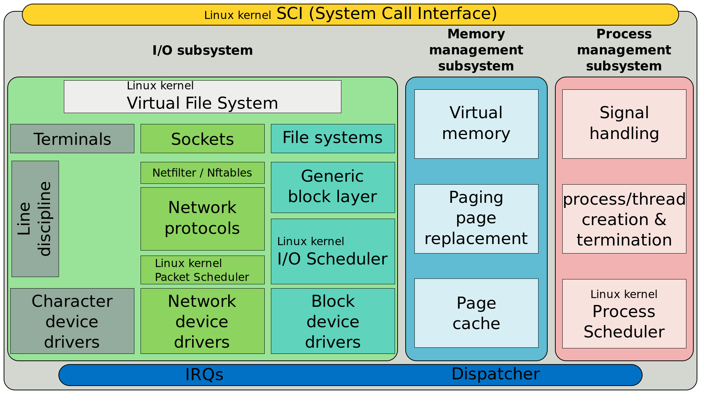

# Introduction

### Keywords
> Context Switching  
> Exception Vector  
> System Call
> Signal Handler  
> Memory Management  
> Function Convention


## Kernel Source Structure
### arch


## File Descriptor
Linux에서는 file, directory, socket, pipe, block device, character device 등 모든 객체들을 파일로 관리한다. 이 때 프로세스가 이 파일들에 접근할 때 FD 개념 사용. 프로세스가 실행 중에 파일은 열면 해당 프로세스의 FD 숫자 중 사용하지 않는 가장 작은 값을 할당. 모든 프로세스는 0(stdin), 1(stdout), 2(stderr)를 기본 할당받음.
```bash
ps -ef
cd /proc/<PID>/fd  # 해당 process의 FD 확인
lsof -p <PID>   # 해당 process가 사용중인 resource 확인
```